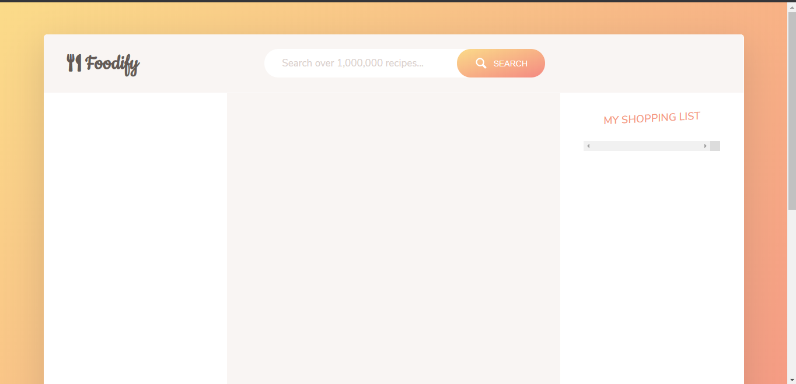

# Foodify

This is a Javascript Based Single Page App which uses MVC approach, lets you search any Food Recipe you want to make or if simply you are curious, also it includes to add the recipe to your cart, give a like to a particular recipe which you loved...

### Description

##### Below are the steps which can be follwed to run current flow at your local machine

#### P.S. - Food2Fork.com have shut down hence the main API Wont Work, this app is for Educational Purposes which shows the modern usage of ES6+ syntax, usage of Webpack for app bundling and Babel to make it browser compatible

- Download [Node.js](https://nodejs.org/en/download/) as we need to install the dependencies
- To install the Dependencies and Dev Dependencies run command **_\$ npm install_** in the directory where you have cloned the repo
- The App uses Webpack, there are three Script commands which can Compile the App in three Modes.

  - (1) Development: **_\$ npm run dev_**
  - (2) Build: **_(For Deployment)_** - **_\$ npm run build_**
  - (3) Hot Reloading: **_(Reloads and Rebuilds the app on each Save)_** - **_\$ npm run serve_** - using this command a new Browser window will automatically open and the **_Foodify_** App will be loaded in that window

  ## This App uses Food2Fork Api which allows 50 requests only per day for free Usage, so i suggest you to signup to get an API Key [here is the link for signing up](https://www.food2fork.com/about/api)

  ### Instructions to Change the Api Key

  - go to the Config file and replace the key variable with your **_API KEY_**

  ## If you like the App please give a Star to my Repo
